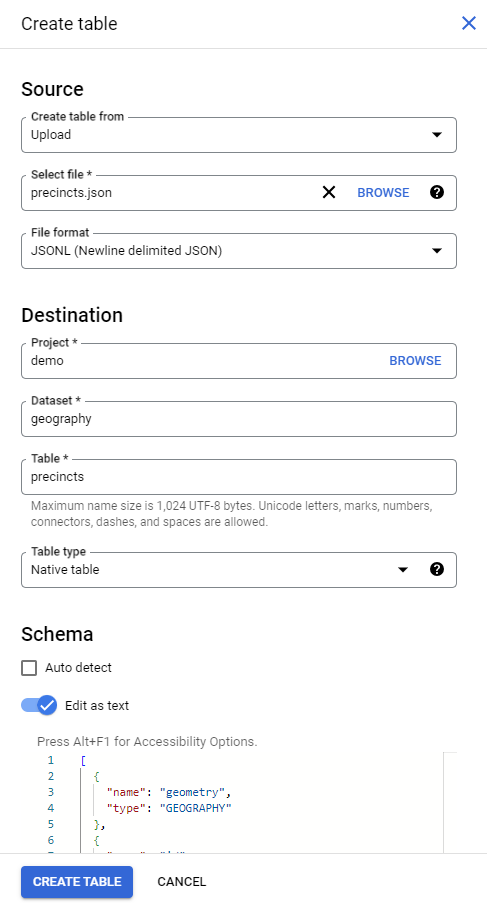

# ogr2bqjson

Convert files with simple features data (Shape, GeoJSON, etc) to [newline-delimited JSON](https://jsonlines.org/) for [importing into a BigQuery table](https://cloud.google.com/bigquery/docs/loading-data-cloud-storage-json) with the feature's geometry in a [GEOGRAPHY](https://cloud.google.com/bigquery/docs/reference/standard-sql/data-types#geography_type) column. Schema files are also generated that can be used to [specify a BigQuery table's schema](https://cloud.google.com/bigquery/docs/schemas#specify_schemas) programmatically or through the BigQuery Console.

ogr2bqjson gets its name from GDAL's [ogr2ogr](https://gdal.org/programs/ogr2ogr.html) program. The GDAL library is used to convert the source file to a [GeoJSONSeq](https://gdal.org/drivers/vector/geojsonseq.html) file, using it to then create the newline-delimited JSON file. The GeoJSONSeq file is deleted afterward, unless the *&#x2011;&#x2011;keep_geojsonseq / &#x2011;k* option is used.

## Warning

This was created as a coding exercise, and is not production-ready code. **Use at your own risk!**


## Table of Contents

- [ogr2bqjson](#ogr2bqjson)
  - [Warning](#warning)
  - [Table of Contents](#table-of-contents)
  - [Prerequisites](#prerequisites)
  - [Output Files](#output-files)
  - [Usage](#usage)
    - [Positional arguments:](#positional-arguments)
    - [Options](#options)
    - [Examples](#examples)
      - [Convert a file (no options).](#convert-a-file-no-options)
      - [Specify the directory to save output files](#specify-the-directory-to-save-output-files)
      - [Specify the full path to save an output file](#specify-the-full-path-to-save-an-output-file)
      - [Convert all files in a directory](#convert-all-files-in-a-directory)
      - [GDAL conversion option to alter the **properties** included in the schema](#gdal-conversion-option-to-alter-the-properties-included-in-the-schema)
      - [Rename the *geometry* column in the schema.](#rename-the-geometry-column-in-the-schema)
      - [Only include the *geojson\_geometry* column in the schema.](#only-include-the-geojson_geometry-column-in-the-schema)
      - [Include all geo columns in the schema.](#include-all-geo-columns-in-the-schema)
  - [Tips / Troubleshooting](#tips--troubleshooting)
    - [Duplicate vertex error when importing into BigQuery](#duplicate-vertex-error-when-importing-into-bigquery)
    - [Error creating temporary GeoJSONSeq file](#error-creating-temporary-geojsonseq-file)
  - [Now What?](#now-what)
    - [Create a BigQuery table using the output file with the BigQuery Console](#create-a-bigquery-table-using-the-output-file-with-the-bigquery-console)
    - [Determine precincts for locations using coordinates and precinct geometry](#determine-precincts-for-locations-using-coordinates-and-precinct-geometry)
  - [TODO](#todo)


## Prerequisites

- Python 3.10.x (this was developed with Python 3.10.12, but an earlier version may work).
- [GDAL](https://gdal.org) installed on your system
  - On Ubuntu 22.04.03, the following installed all necessary packages: `sudo apt install gdal-bin libgdal-dev python3-gdal`.
- Python bindings for your version of GDAL, which ideally would be what `pip install GDAL` installs by default. However, I needed an earlier/specific version to match my native GDAL library (3.4.1, the version specified in requirements.txt). Try this if pip is giving errors when installing GDAL: `pip install GDAL=="$(gdal-config --version).*"` See the [*pip* section of the GDAL documentation](https://gdal.org/api/python_bindings.html#pip).


## Output Files

- **filename.json**: A file containing the geographic features, one per line, in newline-delimited JSON format, that can be imported into a BigQuery table. The schema will consist of the following columns, unless the *&#x2011;&#x2011;convert_options* and/or *&#x2011;&#x2011;columns* flags are used to alter them:

  - **geometry**: The feature's geometry member as a GeoJSON WGS84 formatted string. Intended to be imported into a BigQuery table as a *[GEOGRAPHY](https://cloud.google.com/bigquery/docs/reference/standard-sql/data-types#geography_type)* datatype which can be used for [Geospatial Analytics](https://cloud.google.com/bigquery/docs/geospatial-intro), and [Google Map visualizations in Looker Studio](https://support.google.com/looker-studio/answer/9713352).

  - **Properties columns**: One column for each attribute within the feature's *properties* member

  - **geojson_geometry**: The feature's geometry member as a GeoJSON WGS84 formatted string, intended to be imported as a *STRING* datatype. The *geojson_geometry* column is excluded from the schema by default. [Use the &#x2011;&#x2011;columns / &#x2011;c option to include it](#include-all-geo-columns-in-the-schema). This column can be used to add data to the *geometry* column if there is an issue importing it using the newline-delimited jsonJSON file. *See [Duplicate vertex error when importing into BigQuery](#duplicate-vertex-error-when-importing-into-bigquery) for an example*.

  - **geojson**: The entire feature, including *properties* and *geometry*, as a GeoJSON WGS84 formatted string, intended to be imported as a *STRING* datatype. The *geojson* column is excluded from the schema by default. [Use the &#x2011;&#x2011;columns / &#x2011;c option to include it](#include-all-geo-columns-in-the-schema).

- **filename_SCHEMA.json**: A file containing a json version of the schema that can be used to [specify a BigQuery table's schema](https://cloud.google.com/bigquery/docs/schemas#specify_schemas) programmatically or by copy/pasting in the BigQuery Console. Use the *&#x2011;&#x2011;skip_schemas* option to prevent this file from being created

- **filename_GeoJSONSeq.geojson**: The GeoJSONSeq file temporalty created, and then deleted, during the conversion process. Use the *&#x2011;&#x2011;keep_geojsonseq* / *&#x2011;k* option to prevent this file from being deleted.


## Usage

**ogr2bqjson.py** *[-h] [-f] [-k] [-p] [-s] [-c COLUMNS] [-d OUTPUT_DIRECTORY] [-e EXTENSION] [-o OUTPUT_FILEPATH] [-v CONVERT_OPTIONS]* **source**


### Positional arguments:

| Name | Description |
| ----------- | ----------- |
| source | Path to the source file or directory to convert. |

*Note: positional arguments can be placed at the very beginning or very end, and the order of the options do not matter. Both of the following examples are valid and will do the same thing:*

```sh
python ogr2bqjson.py -k -p -o /output_dir/baz.json /source_dir/foo.bar
```

```sh
python ogr2bqjson.py /source_dir/foo.bar -p -o /output_dir/baz.json -k
```


### Options

| Option | Description |
| ----------- | ----------- |
| -h, &#x2011;&#x2011;help | Show help message and exit. |
| -f, &#x2011;&#x2011;force_overwrite | Overwrite files if they already exist, otherwise an underscore and number ("_n") will be appended to the output file's name: duplicate_01.json, duplicate_02.json, etc. |
| -k, &#x2011;&#x2011;keep_geojsonseq | Do not delete the GeoJSONSeq files created when a source file is not [GeoJSONSeq](https://gdal.org/drivers/vector/geojsonseq.html) with a WGS84 reference system. |
| -p, &#x2011;&#x2011;create_parents | Make directories and parent directories for output files, if they don't already exist. |
| -s, &#x2011;&#x2011;skip_schemas | Skip generating schema file.|
| -c, &#x2011;&#x2011;columns | JSON string to limit or rename the columns for geographic data in the output's schema. Use a JSON array literal if you want to set which columns to include without changing their default names. Use a JSON object to set and/or rename columns. "geometry" refers to the column that will contain the geometry as a [GEOGRAPHY](https://cloud.google.com/bigquery/docs/reference/standard-sql/data-types#geography_type) datatype; "geojson" the column that will have a complete copy of a geo object as a GeoJSON formatted STRING; and "geojson_geometry" the column containing just the geometry object as a GeoJSON formatted STRING. Leaving out a column will result in it being excluded from the schema. Note: only the "geometry" column is included by default. The "geojson" and/or "geojson_geometry" columns can be added manually using this option. |
| -d, &#x2011;&#x2011;output_directory | The path to the directory to save converted files to. The files will be given the same basename as the source, but with .json as the extension. Ignored if the &#x2011;&#x2011;output_filepath option is present. |
| -e, &#x2011;&#x2011;extension | Extension of the files to convert when the source path is a directory. Cannot be used when the source path is a file. |
| -o, &#x2011;&#x2011;output_filepath | The full filepath to save the converted file to. If omitted the file will be saved with the same basename and location as the source, but with the .json extension. Cannot be used when the source path is a directory. |
| -v, &#x2011;&#x2011;convert_options | String containing options to pass to GDAL VectorTranslate() during conversion. These are the same options you would use with ogr2org2 on the cli (see https://gdal.org/programs/ogr2ogr.html or type "*ogr2ogr &#x2011;&#x2011;help*" on the command line). Cannot include any of the following inside the string: *-f, -of, -t_srs*. An equals sign is required before the string if any part of the string contains a hyphen. |

### Examples


#### Convert a file (no options).

Output files will be saved to the same directory, using the same basename as the source. In this case: /source_dir/foo.json

```sh
python ogr2bqjson.py /source_dir/foo.bar
```


#### Specify the directory to save output files

**&#x2011;p** is optional, and will automatically create the output directory and its parents if they don't already exist.

```sh
python ogr2bqjson.py -p -d /output_dir /source_dir/foo.bar
```


#### Specify the full path to save an output file

**&#x2011;f** is optional, and will overwrite any existing file.

```sh
python ogr2bqjson.py -f -o /output_dir/baz.json /source_dir/foo.bar
```


#### Convert all files in a directory

**&#x2011;d** is optional, and specifies the directory to save output files to. In this case all files in */source_dir* ending in *.shp* will be converted, and all output files will be saved to */output_dir*.

```sh
python ogr2bqjson.py -e shp -d /output_dir /source_dir/
```


#### GDAL conversion option to alter the **properties** included in the schema

The **&#x2011;v** option must be followed by an **=** if any part of the string contains a hyphen. In this case *attr1* and *attr2* will be the only **properties** included in the schema, and the column for *attr2* will be named *"qux"*.

```sh
python ogr2bqjson.py -v='-sql "SELECT attr1, attr2 AS qux FROM foo"' /source_dir/foo.bar
```


#### Rename the *geometry* column in the schema.

In this case the column with the *[GEOGRAPHY](https://cloud.google.com/bigquery/docs/reference/standard-sql/data-types#geography_type)* datatype will be named "coordinates".

```sh
python ogr2bqjson.py -c "{\"geometry\":\"coordinates\"}" /source_dir/foo.bar
```


#### Only include the *geojson_geometry* column in the schema.

This is useful if there is an issue importing data into the [GEOGRAPHY](https://cloud.google.com/bigquery/docs/reference/standard-sql/data-types#geography_type) datatype column. *See [Duplicate vertex error when importing into BigQuery](#duplicate-vertex-error-when-importing-into-bigquery) for an example*.

```sh
python ogr2bqjson.py -c "[\"geojson_geometry\"]" /source_dir/foo.bar
```


#### Include all geo columns in the schema.

```sh
python ogr2bqjson.py -c "[\"geometry\",\"geojson\",\"geojson_geometry\"]" /source_dir/foo.bar
```


## Tips / Troubleshooting

### Duplicate vertex error when importing into BigQuery

If you are not able to import the newline-delimited JSON file into BigQuery because it complains that an edge has a duplicate vertex with another edge, try the following:

- use the *&#x2011;&#x2011;columns* / *&#x2011;c* option to include the  "geojson_geometry" column, and exclude the "geometry" column (by omitting it). It is your choice whether to include the "geojson" column.

```sh
python ogr2bqjson.py -c "[\"geojson_geometry\]" /source_dir/foo.bar
```

- [Import into a new BigQuery table](https://cloud.google.com/bigquery/docs/loading-data-cloud-storage-json)

- Add a column to the table with the [GEOGRAPHY](https://cloud.google.com/bigquery/docs/reference/standard-sql/data-types#geography_type) datatype (e.g. *geology*)

```sql
ALTER TABLE my_proj_id.my_ds.my_table ADD COLUMN geometry GEOGRAPHY;
```

- Use BigQuery's [ST_GEOGFROMGEOJSON()](https://cloud.google.com/bigquery/docs/reference/standard-sql/geography_functions#st_geogfromgeojson) function in a SQL query to populate the *geometry* column using the *geojson_geometry* column. Setting the function's *make_valid* parameter to *TRUE* will have it attempt to repair issues, like the duplicate vertex error, during the conversion.

```sql
UPDATE my_proj_id.my_ds.my_table SET geometry = ST_GEOGFROMGEOJSON(geojson_geometry, make_valid => TRUE) WHERE geometry IS NULL;
```

### Error creating temporary GeoJSONSeq file

The program uses GDAL to convert the source to a [GeoJSONSeq](https://gdal.org/drivers/vector/geojsonseq.html) file, and uses this file to create the newline-delimited JSON file. If there are errors during the conversion, you can use GDAL's [ogr2ogr](https://gdal.org/programs/ogr2ogr.html) command to troubleshoot/generate it yourself, and then use the GeoJSONSeq file as the source to create the newline-delimited JSON file.

```sh
ogr2ogr -f GeoJSONSeq -t_srs crs:84 /tmp/foo_GeoJSONSeq.geojson /source_dir/foo.bar

python ogr2bqjson.py -o /output_dir/foo.json /tmp/foo_GeoJSONSeq.geojson

del /tmp/foo_GeoJSONSeq.geojson
```

If you find that ogr2ogr requires an option to convert your source to the proper format, you can use the `-v` option in ogr2bqjson.py to include it during the conversion.

For example, if you find *ogr2ogr* needs the `-if` option to open the source using the correct format/driver (e.g. *ESRI Shapefile*), then you can do something like this:

```sh
python ogr2bqjson.py -v='-if "ESRI Shapefile"' /source_dir/foo.bar
```


## Now What?


### Create a BigQuery table using the output file with the BigQuery Console

You will need a [Google Cloud project](https://cloud.google.com/resource-manager/docs/creating-managing-projects), and a [BigQuery dataset](https://cloud.google.com/bigquery/docs/quickstarts/load-data-console#create_a_dataset)

In the BigQuery Console, click the vertical dots next to your dataset (*geography* in the image below) and then *Create table*


<br /><br />
**Fill out the following fields in the Create table form** (all others can remain at their defaults):

- *Create table from*: Upload

- *Select file*: Click "Browse" to select the output JSON file

- *File format*: JSONL (Newline delimited JSON)

- *Project* and *Dataset* should already be filled in

- *Table*: The name you want to give the table

- *Table type*: Native table

- *Schema*: Click the *Edit as text* slider, and then copy/paste the contents of the [schema file](#output-files) created by ogr2bqjson during conversion

Finally click the *Create Table* button




### Determine precincts for locations using coordinates and precinct geometry

[OpenAddresses](https://openaddresses.io/) lets you download GeoJSON files containing coordinates (geometry type Point) for addresses within a region. You can download shape files of precincts (geometry type Polygon) from the Board of Election website of many US states. Let's say we want to know what precinct each address is located in.

To make the SQL code easier to understand, let's [change the name of the *geometry* column](#rename-the-geometry-column-in-the-schema) for the addresses to *coordinates*, and the one for precincts to *precinct_geom*.

```sh
python ogr2bqjson.py -c "{\"geometry\":\"coordinates\"}" addresses.geojson
```

```sh
python ogr2bqjson.py -c "{\"geometry\":\"precinct_geom\"}" precincts.shp
```

Use the converted files to [create BigQuery tables](#import-into-a-new-bigquery-table-using-the-bigquery-console), one called *addresses*, and the other *precincts*.

We see in the *precincts* table's schema that there is a STRING column called *precinct_id*. This column exists because the *properties* member of the shapefile had this as one of its *attributes*. Let's add a *precinct_id* column to the *addresses* table.

```sql
ALTER TABLE my_project.geography.addresses ADD COLUMN precinct_id STRING;
```

Now we can use the BigQuery function [ST_WITHIN](https://cloud.google.com/bigquery/docs/reference/standard-sql/geography_functions#st_within) to set the precinct_id for each address.

```sql
UPDATE my_project.geography.addresses a
SET a.precinct_id = p.precinct_id
FROM my_project.geography.precincts p
WHERE ST_WITHIN(a.coordinates, p.precinct_geom);
```

You can read this SQL statement as:<br />
> *Set the precinct_id of an address to the precinct_id of a precinct if the address coordinates are within the precinct's precinct_geom*

As long as precincts don't overlap, which they shouldn't, there will be at most one precinct for each address.

If you have a pre-existing address table with columns for latitude and longitude, you can use the [ST_GEOPOINT](https://cloud.google.com/bigquery/docs/reference/standard-sql/geography_functions#st_geogpoint) function to perform the UPDATE:

```sql
UPDATE my_project.geography.addresses a
SET a.precinct_id = p.precinct_id
FROM my_project.geography.precincts p
WHERE ST_WITHIN(ST_GEOPOINT(a.longitude, a.latitude), p.precinct_geom);
```

## TODO

*In no particular order*
- [ ] Unit tests
- [ ] Fix/prevent duplicate vertex issue, and/or warn the user if there are any
- [x] Instructions for loading into BigQuery
- [ ] Instructions for using in Looker Studio map visualizations
- [ ] Check if user can write to destination directory
- [ ] More/better exception handling
- [ ] Make into a pip installable package
